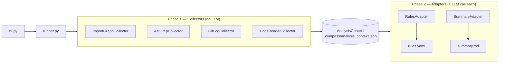
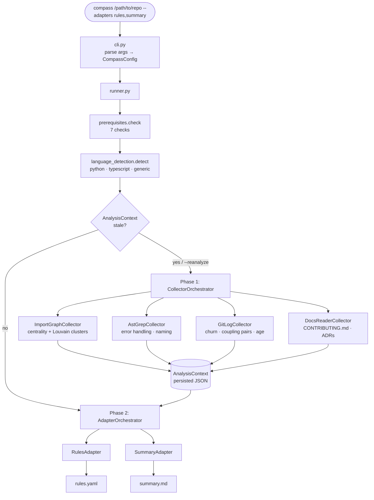
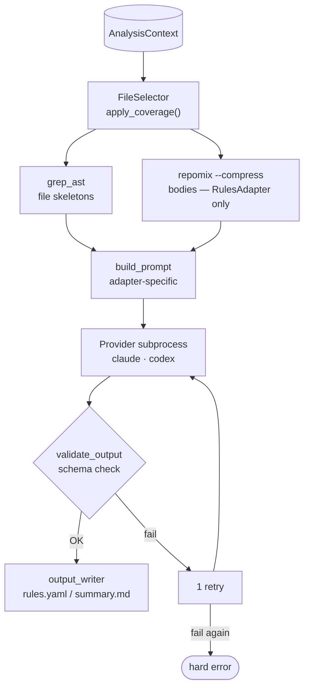
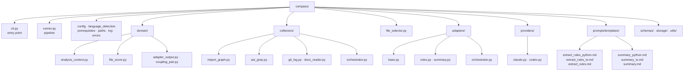
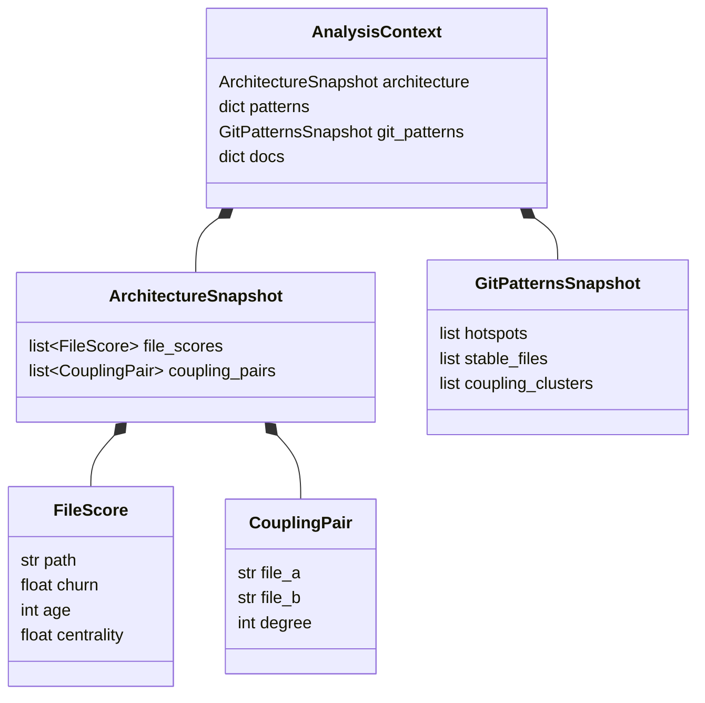

# Compass — Architecture Overview for Interns

> Five diagrams that cover the full system. Start with 1 and 2, dive into 3–5 when you go deeper.
>
> **VS Code:** Install [Markdown Preview Mermaid Support](https://marketplace.visualstudio.com/items?itemName=bierner.markdown-mermaid) by Matt Bierner, then open preview with `Cmd+Shift+V`.
> **GitHub:** Diagrams render automatically — no setup needed.

---

## 1. Top-Level Architecture (Port-Adapter)

---

## 2. Full Pipeline Flow (End-to-End)

---

## 3. Adapter Runtime (Phase 2 Detail)

---

## 4. Package Structure

---

## 5. AnalysisContext Data Model

